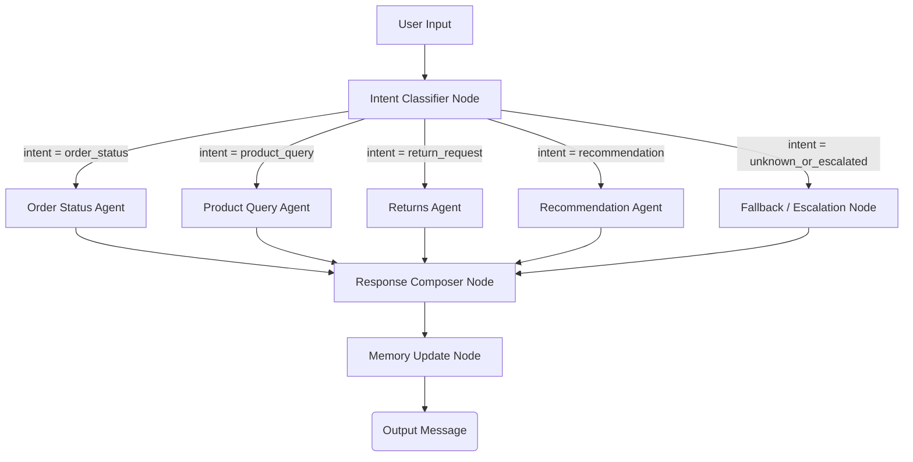

# Stateful Multi-Agent E-Commerce Customer Support Chatbot

An advanced, stateful, multi-agent customer support chatbot for an e-commerce platform built using **LangChain**, **LangGraph**, **LangSmith**, and **SQLite**. The system utilizes specialized sub-agents to handle customer orders, product inquiries, return flows, and personalized shopping recommendations, featuring context-driven memory, loop-prevention escalation, and automated evaluation metrics.

---

## 🚀 Key Features

*   **Stateful Agent Workflows (LangGraph)**: Defined as a directed graph where control flows from an Intent Classifier node to specialized sub-agents (`order_status`, `product_query`, `return_request`, `recommendation`, or `fallback_escalation`) and finishes at a unified Response Composer.
*   **Conversational Memory (`follow_up_context`)**: Tracks entities across multiple conversational turns, allowing relative pronoun resolution (e.g. knowing that asking *"Can I return it?"* after discussing order `O1002` refers to `O1002`).
*   **Specialized E-Commerce Business Logic**:
    *   **Orders**: Differentiates between single shipped orders, single processing, multiple active orders (clarification flow), cancelled orders, and invalid IDs.
    *   **Products**: Handles in-stock listings, out-of-stock category alternatives, fuzzy product searches, and multi-product matches.
    *   **Returns**: Inspects return status (approved/pending) or calculates order return eligibility (must be `delivered` and within `30 days` of the current date).
    *   **Recommendations**: Recommends top-rated products from categories the customer *has not* explored yet, supporting strict category and budget filters.
*   **Loop Escalation**: Tracks intent iteration. If the user repeats the same intent $\ge 3$ consecutive times without resolution, it triggers human agent handoff.
*   **Dual-Mode Engine (Portability)**:
    *   *LangSmith Hub Integration*: Dynamically pulls prompt templates from the LangSmith Hub when an API key is available, falling back to a local `prompts/` directory when offline.
    *   *Zero-Config MockLLM*: Integrates a custom LangChain-compatible `MockLLM` fallback that runs the SQLite database queries, intent classification, and state transitions locally if no LLM API keys are set.
*   **Observability & Tracing**: Programmatically tags LangSmith runs with customer metadata, intent categories, and flags human handoffs with `escalated: true`.
*   **Automated Evaluation Suite**: Contains a dataset of **25 distinct support test cases** and a scoring script showing **100% intent classification accuracy**.

---

## 🛠️ Architecture Overview



---

## 📊 Database Schema

Our relational SQLite database (`ecommerce.db`) enforces referential integrity:

```mermaid
erDiagram
    customers {
        text customer_id PK
        text name
        text email
    }
    products {
        text product_id PK
        text name
        text category
        real price
        integer stock
        real rating
    }
    orders {
        text order_id PK
        text customer_id FK
        text product_id FK
        integer quantity
        real price
        text status
        text tracking_info
        text delivery_date
        text estimated_delivery_date
        text order_date
    }
    returns {
        text return_id PK
        text order_id FK
        text status
        real refund_amount
        text timeline
    }

    customers ||--o{ orders : places
    products ||--o{ orders : contains
    orders ||--o? returns : "returns"
```

---

## 📦 Installation & Setup

1.  **Clone the Repository** and navigate to the project directory:
    ```bash
    "https://github.com/Vidyasri17/E-Commerce-Query-Chatbot"
    ```

2.  **Install Dependencies**:
    ```bash
    pip install faker sqlalchemy langchain langchain-openai langchain-anthropic langgraph langchain-community langchainhub pydantic
    ```

3.  *(Optional)* **Configure Observability & LangSmith Hub**:
    If you wish to trace calls or push prompts to your LangSmith Hub, configure your environment variables:
    ```powershell
    $env:LANGSMITH_API_KEY="your-langsmith-key"
    $env:LANGSMITH_TRACING="true"
    $env:OPENAI_API_KEY="your-openai-key"
    ```
    *Note: If no environment variables are set, the system will run deterministically in local local-fallback MockLLM mode, meaning it remains 100% executable.*

---

## 🚦 How to Run & Verify

### 1. Seed the Database
Run the database seeding script. This creates `ecommerce.db` with customers, products, orders, and returns, populating it with random-seeded Faker data:
```bash
python seed_db.py
```
*Expected Output summary:*
*   Table `customers`: 30 rows.
*   Table `products`: 22 rows (at least 5 with 0 stock).
*   Table `orders`: 44 rows (at least 10 customers with multiple orders).
*   Table `returns`: 8 rows.

---

### 2. Run the Intent Accuracy Evaluation Suite
Run the automated evaluation against our ground-truth dataset of 25 support queries:
```bash
python evals/run_evals.py
```
*Verification standard:*
*   Processes 25 multi-intent cases.
*   Returns an **Accuracy Score of 100.00%** (PASS).

---

### 3. Run the Automated Conversational Test Suite
Run the E2E scripted support scenario (including turn-by-turn memory retention, O1002 jacket check, eligible return generation, and loop escalation to human handoff):
```bash
python chat.py --test
```
*Verifies:*
*   **Context Retention**: Correctly correlates *"Can I return it?"* with O1002 (jacket).
*   **Return Eligibility**: Computes delivered order age and registers refund pending details.
*   **Escalation Logic**: Routes a query repeated 3 times directly to a human handoff.

---

### 4. Chat Interactively
Start the live terminal CLI interface to test queries manually:
```bash
python chat.py
```

---

## 📂 Project Structure

```
├── ecommerce.db                  # Relational database (SQLite)
├── seed_db.py                    # SQLite database creation & mock seeding script
├── agent.py                      # Core multi-agent state graph compiled in LangGraph
├── chat.py                       # CLI Chatbot and scripted E2E conversation test harness
├── upload_prompts.py             # Script to programmatically push prompt templates to LangSmith Hub
├── prompts/                      # Local prompt templates folder (dual-mode backup)
│   ├── intent_classifier.txt
│   ├── order_agent.txt
│   ├── product_agent.txt
│   ├── returns_agent.txt
│   ├── recommendation_agent.txt
│   └── fallback_agent.txt
├── evals/                        # Evaluation Suite
│   ├── dataset.json              # Ground truth test dataset containing 25 support queries
│   └── run_evals.py              # Evaluator score script checking intent accuracy
└── README.md                     # Project documentation
```
